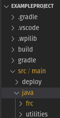

# FRC Utilities 

A custom addition to WPI Lib

## Main Features

- PID controller with velocity control and configurable limits
- A waypoint based autonomous
- Targeting system with in built target leading, prediction, and other tools

## Adding Utilities to your FRC project

Download the latest release from the Release side bar and copy the utilities folder to your projects java folder 

## Coordinate Finder

Detailed installation instructions can be found [here](docs/MarkDown/CoordinateFinderInstallation.md). Instructions for use can be found at our website here.

## Use and Documentation

Examples of how to use each class can be found in the [Example Project](ExampleProject/src/main/java/frc/robot), Java Documentation can be found at our website here, step by step instructions can also be found for

- Configurable PID

- Autonomous

- Targeting System

## Help or report a bug

Email us at team4598programming@gmail.com 
